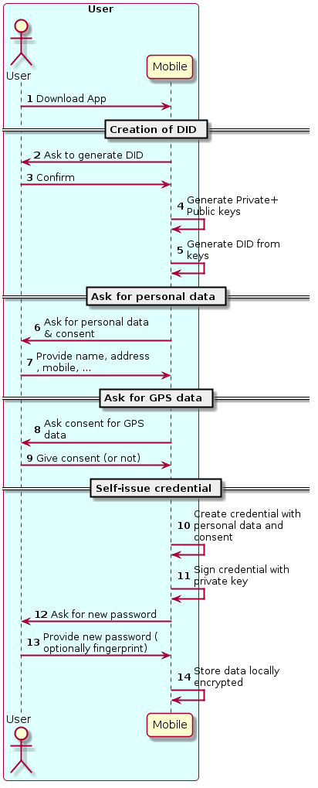

# Onboarding

There are four types of entities that have to be onboarded in the system:

1. **Practitioners**: this is ageneral term used to denote all those professionals who can create and issue some specific types of credentials to the citizens. The term includes doctors and other health-related staff, but it can also denote some other professionals that can issuse credentials in some circumstances, like a police officer. They can issue credentials directly, without using any intermediate computer system of an intitution.

2. **Health institutions**: they can issue many types of credentials, via their computer systems. Those credentials are normally issued by employees of the institution using its computer systems, but the employees do not appear here. These employees do not have to be confused with the **practitioner** entity, which is a natural person that can issue credentials directly and independently from the health institution.

3. **Officials**: the term refers in general to those professionals who can verify credentials presented by citizens. They can make the verification directly, in the same way that practitioners can issue credentials directly. One example is a police officer checking in the street that a citizen holds an appropriate credential signed by a practitioner. Even though the term does not imply it, any citizen can also verify any credential presented by any other citizen. In this case, the citizen is acting in the role of an official.

## Citizen onboarding

We want to make onboarding as simple and fast as possible.
Essentially, the onboarding process consists on the creation of the SSI identity, in the form of a DID.
In this use case, we do not require that citizen identities are of the highest level according to the eIDAS classification and we can start with lower levels and escalate levels later.
An example of this process is the following:

1. The citizen generates the DID locally with her mobile device and without registering the DID in any external system (so this DID will not be anchored to any blockchain).
The DID is stored in her mobile only.

2. The citizen creates a self-attested credential including basic personal information like name, surname and phone number.
The credential will be self-signed with the private key associated to the self-issued DID.
This credential is also stored only in her mobile.

3. When visiting a doctor, the doctor verifies the real identity of the citizen and then acts in the role of **practitioner** and creates a credential to the citizen, signed by the private key of the DID of the doctor (which is public and registered in the blockchain).
The credential issued by the doctor will include the personal data that the citizen entered when creating her self-issued credential.

4. The citizen stores the credential issued by the doctor in her mobile device. She can present the credential to any other entity, and the verifier can know that a doctor issued a statement about that citizen, including the verification of her personal data.

The next paragraph describes the onboarding process. For the other interactions, see the appropiate chapters.

### Sequence diagram for citizen onboarding

The user downloads the mobile application and registers.
There is **not any interaction** with any external server, all activity is local to the mobile so privacy is preserved.
The password is entered to safeguard the data in the mobile (eg. encrypting the data).
The system supports the fingerprint as a substitute of the password.
The pair of keys are generated locally in the mobile and never leave the device.

After this process, the citizen has in her mobile a self-issued credential which is not yet validated by anybody, so the trust on the included personal data is very low.
However, this data will be validated to some extent when a practitioner issues a health status credential, as shown in the following diagram.

## Practitioner

(TBD)

## Verifier (natural person)

(TBD)

## Verifier (legal entity)

(TBD)